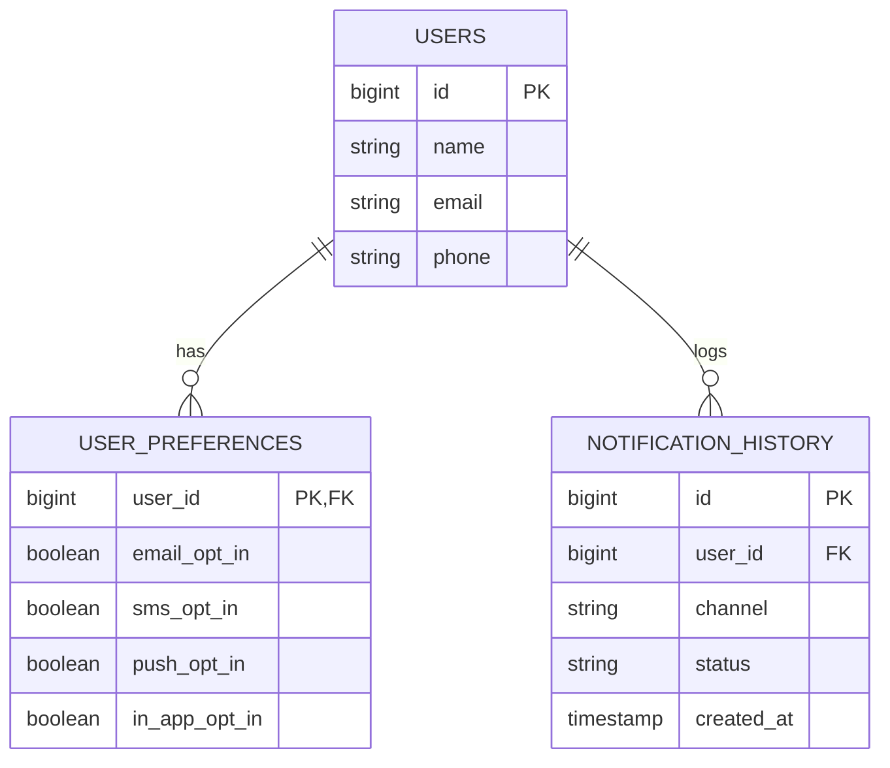
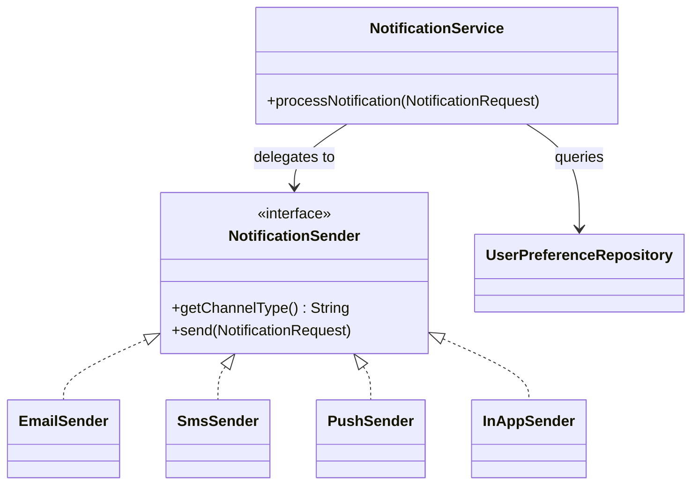

# Notification System Backend

This is a unified backend service that receives message payloads and routes them to user channels (Email, SMS, Push, In-App) while strictly respecting user opt-in preferences.

## How to Run & Test

1. Clone the repository and navigate into the project folder:
```bash
git clone [https://github.com/ankitdash-1407/Smart_Mailroom.git](https://github.com/ankitdash-1407/Smart_Mailroom.git)
cd Smart_Mailroom/demo
```

2. Run the application using Maven: 
```bash
./mvnw spring-boot:run
```
*(Note for Windows users: Use `.\mvnw.cmd spring-boot:run`)*

3. The H2 in-memory database is pre-populated with a test user (ID: 1).

4. Test the API using cURL:
```bash
curl -X POST http://localhost:8080/api/notifications/send \
-H "Content-Type: application/json" \
-d '{
  "userId": 1,
  "title": "Welcome!",
  "body": "Hello World",
  "channels": ["EMAIL", "SMS", "PUSH"]
}'
```

5. **Interactive API UI (Swagger):** You can also test the API visually without a terminal. While the server is running, navigate to `http://localhost:8080/swagger-ui/index.html` in your browser.

## ER Diagram



## Class Diagram

